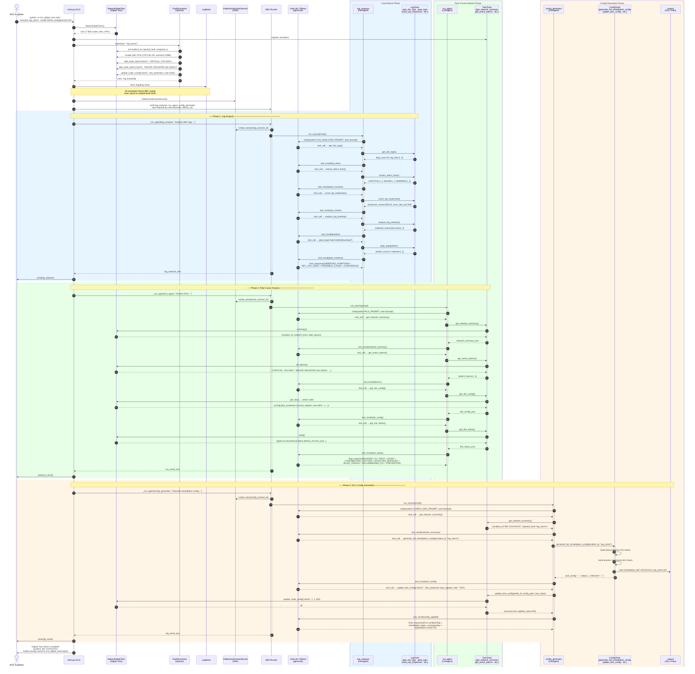

# IMS Digital Twin — RCA Workflow Sequence Diagram

## Participants

| Participant | Role |
|---|---|
| **NOC Engineer** | Operator who triggers the demo via CLI |
| **main.py** | Entry point — parses args, wires twin + agents, drives pipeline |
| **NetworkStateTwin** | Mutable in-memory model of the 7-node IMS topology (SBC, P-CSCF, I-CSCF, S-CSCF, HSS, PCRF, MGW) |
| **FaultScenarios** | Injects one of 6 named fault scenarios into twin state and generates realistic SBC log lines |
| **LogStore** | Module-level list holding the simulated syslog lines for the session |
| **InMemorySessionService** | Google ADK session manager — one independent session per agent |
| **ADK Runner** | Google ADK runner — streams events from an LlmAgent until `is_final_response()` |
| **LiteLLM / Ollama** | LLM backend bridge — routes to local Ollama (default: `gemma4:e4b`) |
| **log_analyzer** | ADK LlmAgent that reads raw logs and produces a structured symptom report |
| **LogTools** | Functions exposed as ADK tools: `get_sbc_logs`, `grep_logs`, `count_sip_responses`, `extract_alarm_lines`, `analyse_log_timeline`, `extract_sip_call_ids` |
| **rca_agent** | ADK LlmAgent that queries the digital twin and produces a formal RCA report |
| **TwinTools** | Functions exposed as ADK tools: `get_network_summary`, `get_active_alarms`, `get_sbc_config`, `get_link_status`, `get_node_detail`, `update_twin_config` |
| **config_generator** | ADK LlmAgent that generates Oracle SBC ACLI remediation configuration |
| **ConfigTools** | Functions exposed as ADK tools: `generate_full_remediation_config`, `generate_dos_protection_config`, `generate_tls_profile_config`, etc. |
| **output/** | File system directory where generated `.acli` config files are persisted |

## Fault Scenarios

| Key | Name | Trigger |
|---|---|---|
| `reg_storm` | SIP Registration Storm | REGISTER flood → CPU spike, cache exhaustion, 503s |
| `tls_cert_expiry` | TLS Certificate Expiry | Expired cert → SIP/TLS handshake failures |
| `rtp_timeout` | RTP Media Timeout | No RTP packets → one-way audio, call clears |
| `codec_mismatch` | SIP Codec / SDP Mismatch | G.729 stripped by policy → 488 Not Acceptable |
| `pcscf_down` | Upstream P-CSCF Unreachable | Health-check failure → all INVITEs return 503 |
| `srtp_dtls_fail` | SRTP/DTLS Negotiation Failure | DTLS cipher mismatch → calls connect with no media |
